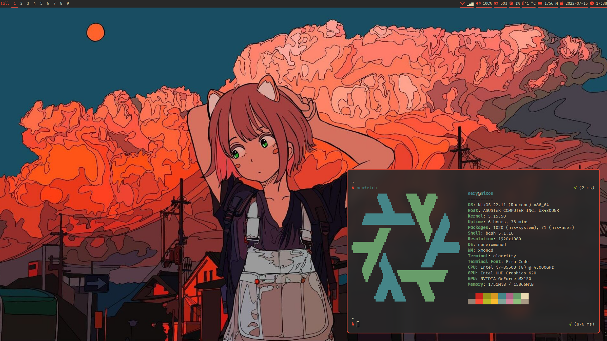
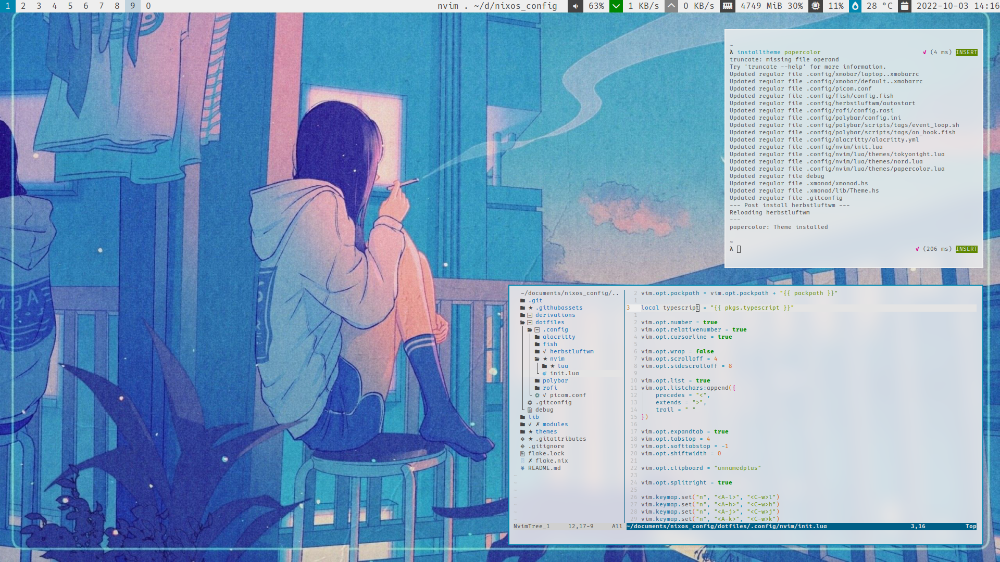

# NixOS configuration & dotfiles

## Specs

* XMonad + xmobar
* [picom (jonaburg/picom)](https://github.com/jonaburg/picom)
* neovim – Configured with lua
* Theming via Nix + shell scripts

## Screenshots




# Installing

```
nixos-rebuild switch --flake .#<theme>.<host>
```

# Switching theme

```
installtheme <theme>
```

# Adding a host

Create a directory in `modules/host` with your hostname.  
It must contain a `default.nix` file and should evaluate to a Host (See type definitions).  
You may optionally import a `hardware-configuration.nix` file from within your host's module.
You can generate this file using `nixos-generate-config` or you can copy it from your own NixOS configuration.

**Hosts are required to define a [`boot.loader`](https://search.nixos.org/options?query=boot.loader) and define [`system.stateVersion`](https://search.nixos.org/options?query=system.stateVersion).**
**These options are not defined in `configuration.nix`.**

# Type definitions

```
Host :: {
    options :: {
        # The host's Nix platform type e.g. "x86_64-linux" "aarch64-linux".
        system :: string

        # Available roles:
        # * "laptop" — The host is a laptop.
        # * "bluetooth" — The host should enable bluetooth functionality.
        roles :: [ string ]
    }

    module :: NixOSModule
}
```

```
# Color strings should be 6 digit hexadecimal RGB prefixed with "#".

Theme :: {

    foreground :: string
    background :: string

    primary :: string
    # Should be a key of terminalColors.
    primaryTerminalColor :: string

    terminalColors :: {
        black :: string
        blue :: string
        green :: string
        cyan :: string
        red :: string
        magenta :: string
        yellow :: string
        white :: string
        brightBlack :: string
        brightBlue :: string
        brightGreen :: string
        brightCyan :: string
        brightRed :: string
        brightMagenta :: string
        brightYellow :: string
        brightWhite :: string
    }
}
```
