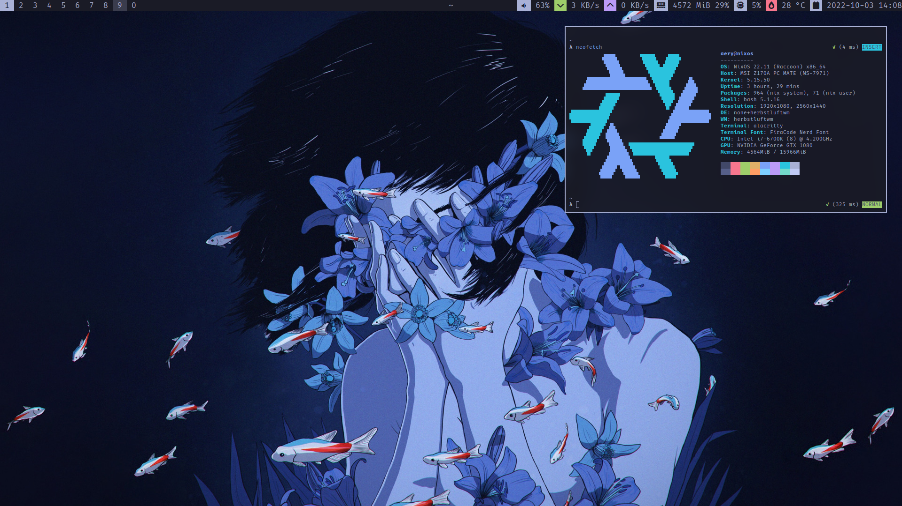

## Specs

* [herbstluftwm](https://herbstluftwm.org/) + [polybar](https://github.com/polybar/polybar/)
* [picom (jonaburg/picom)](https://github.com/jonaburg/picom/)
* [alacritty](https://github.com/alacritty/alacritty/) terminal + [fish](https://fishshell.com/) shell
* [neovim](https://neovim.io/) – Configured with Lua
* Theming via Nix + shell scripts

## Screenshots

Tokyo Night theme

PaperColor theme

[Installation README](INSTALL.md)
